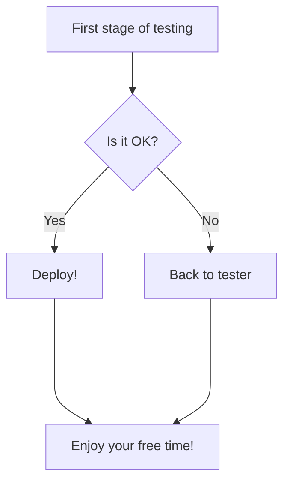

## Mindmaps and diagrams of testing approaches:

* This is an example of [E-commerce site testing](https://drive.google.com/file/d/1Q5T6far0q_RegiJ-6ZZW20nili5lhM4w/view?usp=sharing)

## How to create a diagram

